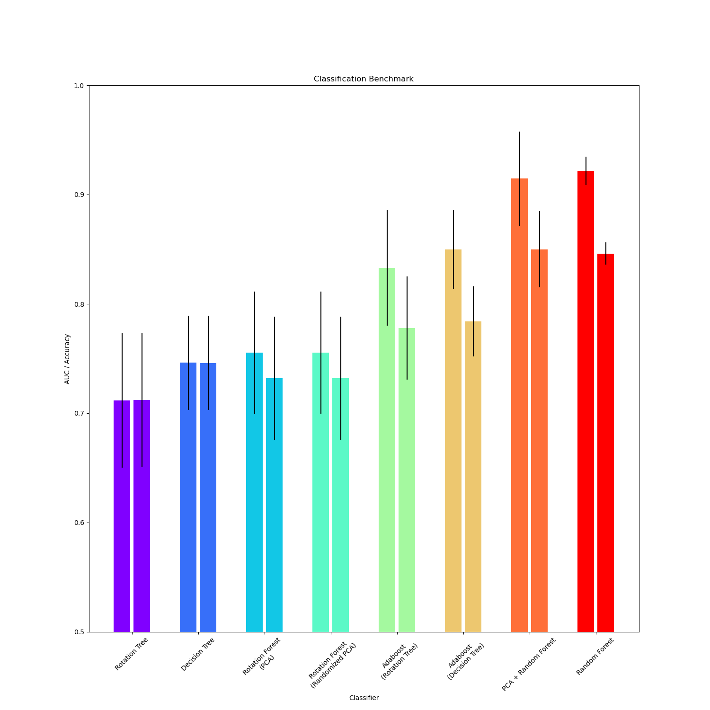
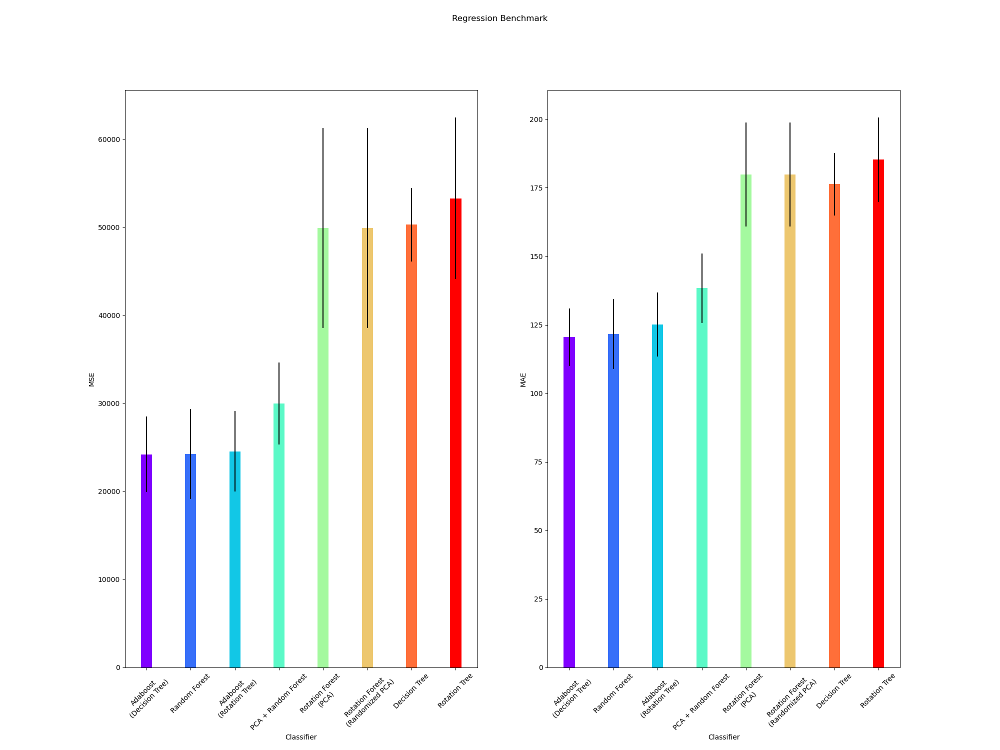

Rotation Forest
---
[](https://travis-ci.org/digital-idiot/RotationForest) [](https://opensource.org/licenses/MIT)
---
Simple derived implementation of <b>Rotation Forest</b> algorithm<sup>[1, 2]</sup>  based upon sklearn's random forest module.


Algorithm
---
```
for tree in trees:
	split the attributes in the training set into K non-overlapping subsets of equal size.
	bootstrap þ% of the data from each K dataset and use the bootstrap data in the following steps:
		- Run PCA on the i-th subset in K. Retain all principal components. For every feature j in the Kth subsets, we have a principal component a.
		- Create a rotation matrix of size n X n where n is the total number of features. Arrange the principal component in the matrix such that the components match the position of the feature in the original training dataset.
		- Project the training dataset on the rotation matrix.
		- Build a decision tree with the projected dataset
		- Store the tree and the rotation matrix.
```

* Rotation forest has been implemented both as classifier<sup>[1]</sup> and regressor<sup>[2]</sup>.


<sup>
[1] J. J. Rodriguez, L. I. Kuncheva, and C. J. Alonso, “Rotation Forest: A New Classifier Ensemble Method,” IEEE Trans. Pattern Anal. Mach. Intell., vol. 28, no. 10, pp. 1619–1630, Oct. 2006, doi: 10.1109/tpami.2006.211. 
</sup>

<sup>
[2] C. Pardo, J. F. Diez-Pastor, C. García-Osorio, and J. J. Rodríguez, “Rotation Forests for regression,” Applied Mathematics and Computation, vol. 219, no. 19, pp. 9914–9924, Jun. 2013, doi: 10.1016/j.amc.2013.03.139. 
</sup>

---

## Toy Benchmark
* ### Random Forest Classifier



* ### Random Forest Regressor


